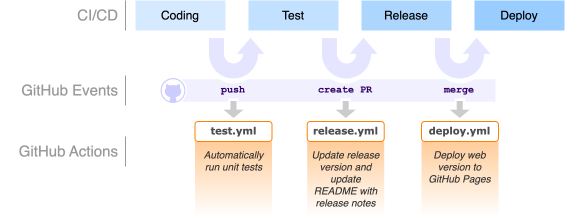

# GitHub Actions Experiments

This repository illustrates how GitHub Actions can be used to automate software development processes.

## Introduction

### What are GitHub Actions?

GitHub Actions are scripts that run on a containerized platform hosted on GitHub. A GitHub action is defined by creating a `.yml` file in the `.github/workflows` directory of a repository (as done here). Such an action needs to be follow a specific format as described in the [GitHub documentation](https://docs.github.com/en/actions/about-github-actions/understanding-github-actions). An example is provided in  the `triage_issues.yml` action file:

```yaml
name: "Label Issues for Triage"
on:
  issues:
    types:
      - reopened
      - opened
jobs:
  label_issues:
    runs-on: ubuntu-latest
    permissions:
      issues: write
    steps:
      - run: gh issue edit "$NUMBER" --add-label "$LABELS"
        env:
          GH_TOKEN: ${{ secrets.GITHUB_TOKEN }}
          GH_REPO: ${{ github.repository }}
          NUMBER: ${{ github.event.issue.number }}
          LABELS: triage
```

An action consists of the following basic components:
- `name`: name of the action.
- `events`: the `on` keyword specifies under what circumstance the action should run. In this example, the action will run when an issue is opened or reopened.
- `jobs`: specifies one or more things that should happen when the event is triggered. Here, we issue a command to GitHub to edit the modified issue by adding a label.

We will see other types of events and actions later on.

If you are familiar with **containerized applications**, you will notice familiar concepts. One key aspect of a container is to specify its base operating system. Here, we specify that we want to run the latest available version of Ubuntu, which is a Linux operating system. Jobs are similar to `RUN` commands in Docker but are tailored specifically to the task of automating processes and provide many capabilities related to interacting with GitHub.

Now that you understand the basic structure of a GitHub Action, we will see on in, well, action.

### 🚀 Galactic Pizza Delivery Time Estimator

In this exercise, you will work with a small application called the **Galactic Pizza Delivery Time Estimator**. The program calculates how long it takes to deliver a pizza to different planets using several factors: the destination distance, the delivery mode (normal, turbo, or hyperjump), a surge-load multiplier, and a weather-delay component. Some planets involve long-distance fatigue penalties, while incorrect inputs or unexpected weather values trigger errors.

The application can be found in in the `spacedelivery` folder. There are two versions:

- `python`: the Python version is a single module (`delivery.py`) and just one function. That module will be used for illustrating **building**, **testing**, and **releasing** an applications using GitHub Actions.
- `web` : the web version is a static web application of essentially the same functionality as the Python version. It also implments a user interface. This version is used to illustrate how to **deploy** a static web application to GitHub Pages via GitHub Actions.

The application itself is secondary and only used to illustrate CI/CD concepts.

### Directory structure

The directory structure is as follows:

```bash
actions/
├── .github/                          # GitHub-specific configuration
│   └── workflows/                    # This is where GitHub will look for `.yml` Action files.
├── deployment_scripts/               # Python scripts that will be called by the *release* Action
├── spacedelivery/                    # Main application package
│   ├── delivery.py                   # Python module for delivery calculations
│   └── web/                          # Web version of the application to be deployed by the *deploy* Action
├── tests/                            # Tests that will be executed by the *test* Action
├── __version__.py                    # Version information to be updated by the *release* Action
└── requirements.txt                  # Python dependencies that will be installed during the *build* Action
```

### Getting Started

Fork the repository and clone it to your local machine. Then create a new branch called `development`:

```bash
git checkout -b development
```

All exercises will be done on the `development` branch that we will merge into the `main` branch occasionally.

## Exercises

This lab gradually builds up a CI/CD pipeline using GitHub Actions. As you know, Continuous Integration (CI) and Continuous Deployment (CD) are practices that help teams deliver software quickly and reliably. CI focuses on automatically **building** and **testing** code every time changes are made, ensuring that bugs are caught early and that new work integrates smoothly. CD extends this idea by automatically **releasing** and **deploying** software after it passes tests. GitHub Actions provides an easy way to implement CI/CD directly within a GitHub repository. By defining simple workflow files, you can automate tasks such as running tests, checking code quality, updating version numbers, or deploying applications—all triggered whenever code is pushed or a pull request is opened.

The diagram below shows the steps of the CI/CD pipeline that we will build in this lab:



We will implement GitHub Actions that are automatically triggered by events in GitHub, namely:
- `push` event: runs tests whenever a new commit is pushed to the repository
- `pull_request` event: runs tests whenever a new pull request is opened against the repository
- `merge` event: runs tests whenever the PR is merged into the `main` branch.

These events will trigger GitHub Actions to build, test (`test.yml`), release (`release.yml`), and deploy (`deploy.yml`) the application. You will create this Actions as you follow the exercise instructions.

## Exercise 1: **Testing**

One of the tasks that goes along with making changes to your code is testing. We have learned how to create test cases and even implemented unit tests that can be executed automatically. As part of a CI (Continuous Integration) pipeline, we can run tests automatically whenever a new commit is pushed to the repository. In this exercise, we will integrate that part of the CI pipeline using GitHub Actions.

In the `.github/workflows` directory, create a new file names `test.yml` and copy the following contents:

```yaml
name: Build and test

on:
  push:
    branches: ["development"] # Triggered when a commit is pushed to the development branch

jobs:
  build:
    runs-on: ubuntu-latest # Run this code on a Linux Virtual Machine (VM)

    steps: # Steps that are executed for this Action

      # Checks out the code into the VM
      - name: Checkout repository
        uses: actions/checkout@v4

      # Installs Python
      - name: Set up Python
        uses: actions/setup-python@v5
        with:
          python-version: "3.11"

      # Installs the dependencies
      - name: Install Dependencies
        run: pip install -r requirements.txt

      # Discovers and runs the tests 
      - name: Run tests
        run: pytest -q
```

Save the file and push the changes to the repository:

```bash
git add --all
git commit -m "Added test action"
git push
```

Now, go to your GitHub repository page in your browser and click on the Actions tab. You should see the test action running. Click on the action to reveal details about each step of the action (as defined in the `steps` section of the workflow file).

Is your Action failing? That's ok. That's what we expect. Let's fix it. Check the details of the failed test output. It should tell you what test was failing and where in the code that failure occurred. Go to the respective test in `tests/test_delivery.py` and update the test case to match the value that is returned by the function.

Once you update the test case, push your changes to the repository with the same commands as above. Again, navigate to the Actions tab in GitHub to see the output of the test run.

This exercise illustrates one of the most fundamental parts of a CI/DC pipeline: automated quality assurance by executing test cases. That provides developers early warning signs that something is broken and should be fixed immediately.

## Exercise 2: **Release**

Imagine you have completed making changes to the *Galactic Pizza Delivery Time Estimator* and are ready to push a new release out to your users. There are a variety of steps that could be entailed in a release process. For this exercise, we will have our GitHub Action automatically update the version of our application and create release notes.

ℹ️ [**Semantic versioning**](https://semver.org) is a standardized way of assigning version numbers so that users can understand the scope and impact of changes in a release. A semantic version has the form `MAJOR.MINOR.PATCH` (e.g., `1.8.16`). The `MAJOR` number increases when changes break backward compatibility, `MINOR` increases when new features are added without breaking existing behavior, and `PATCH` increases for backwards-compatible bug fixes.

Keep up with version can be tedious. So we will let GitHub Action handle the versioning for us. Create a new file in `.github/workflows` and copy the content below:

```yaml
name: Update version and add release notes to README

on:
  pull_request:
    types: [opened] # Only executed when a new PR is created

permissions: # Required for the Action to change our version and README files
  contents: write
  pull-requests: write
  
jobs:

  update_readme:

    runs-on: ubuntu-latest

    steps:

      - name: Checkout repository
        uses: actions/checkout@v4
        with:
          ref: ${{ github.head_ref }}

      - name: Set up Python
        uses: actions/setup-python@v5
        with:
          python-version: "3.x"

      # Calls a Python script to increase the version number in `__version__.py`
      - name: Increase version number
        env:
          PR_TITLE: ${{ github.event.pull_request.title }}
        run: |
          python deployment_scripts/update_version_number.py

      # Calls a Python script to update the release notes in `README.md`
      - name: Update release notes
        env:
          PR_TITLE: ${{ github.event.pull_request.title }}
          PR_BODY: ${{ github.event.pull_request.body }}
        run: |
          python deployment_scripts/update_release_notes.py
 
      # Commits the changes the script made to `__version__.py` and `README.md`
      - name: Commit changes
        run: |
          git config user.name "github-actions[bot]"
          git config user.email "github-actions[bot]@users.noreply.github.com"
          git add __version__.py
          git add README.md
          git commit -m "Add release notes for PR #${{ github.event.pull_request.number }}" || echo "No changes to commit"
          git push
```

The Action itself doesn't do a lot. It just calls Python scripts that reside in our repo (`deployment_scripts`):

- `update_version_number.py`: reads the version number from `__version__.py` and increments it.
- `update_release_notes.py`: reads the PR title and body and adds them to the `README.md` file.

These Python scripts use the information you enter in your PR title and description. To increase the version number, it checks if the PR title contains `major` or `minor`. If so, it will increase the respective part of the semantic version number. The description of the PR will be used as the release notes that are inserted into the README file.

### Tasks A

Once you created the `release.yml` Action file, push it to the repository as described above. Now, go to the `Pull request` tab of your GitHub repository. Create a new PR with the following info:

- Title: `Emergency fix for cheese crust pizza`
- Body:
  ```
  - Patching a bug found when calculating cheese crust pizza delivery cost.
  - Slight UI improvements.
  ```

Create the PR and go to the `Actions` tab. You should see the release Action running or already be completed. After the Action is completed, check the `Files changed` section in the PR for the changes made to `__version__.py` and `README.md`.

❓ Can you see what part of the version number was updated (e.g., major, minor, patch)? Do you know why?

We don't really want to merge this PR. Got ahead and click on `Close pull request` at the very bottom of the `Conversation` tab of the PR.

### Tasks B

Now, let's see if we can make our Action update the `Minor` part of the semantic version number. Create a new PR with the following details:

- Title: `Minor update for delivery to Mars`
- Body:
  
  ```bash
  - Can now calculate delivery to Mars!
  - Minor bug fixes
  ```

Create the PR and check again on the Action execution and then the changes it made. Did it work to increase the `minor` part of the version number?

Let's keep this PR open since we'll use it in the next exercise.

This exercise illustrated how we can use GitHub Actions to automate the release process, letting developers focus on being productive and leaving tedious task up to the CI/CD pipeline.

## Exercise 3: Deploy

To make our application available to users, we need to deploy it to some server. For this exercise, we will use GitHub Pages to host our application. GitHub pages. GitHub Pages is a free hosting service provided by GitHub that allows you to publish static websites directly from a GitHub repository.

Create a file in `.github/wokflows` and name it `deploy.yml`. Then copy the contents below:

```yml
name: Deploy static content to Pages

on:
  push:
    branches: [ main ] # Runs when PR is merged to main branch or code is pushed directly to main

  # Allows you to run this workflow manually from the Actions tab
  workflow_dispatch:

# Sets permissions of the GITHUB_TOKEN to allow deployment to GitHub Pages
permissions:
  contents: read
  pages: write
  id-token: write

# Allow only one concurrent deployment, skipping runs queued between the run in-progress and latest queued.
# However, do NOT cancel in-progress runs as we want to allow these production deployments to complete.
concurrency:
  group: "pages"
  cancel-in-progress: false

jobs:

  deploy:
    environment:
      name: github-pages
      url: ${{ steps.deployment.outputs.page_url }}
    runs-on: ubuntu-latest
    steps:

      - name: Checkout
        uses: actions/checkout@v4

      - name: Setup Pages
        uses: actions/configure-pages@v5

      - name: Upload artifact
        uses: actions/upload-pages-artifact@v3
        with:
          path: "./spacedelivery/web" # directory containing the web app files

      - name: Deploy to GitHub Pages
        id: deployment
        uses: actions/deploy-pages@v4
```

Now, push the changes to the `development` branch. Go to the PR that should still be open. If not, you can just create a new PR merging the `development` branch into the `main` branch. Next, click on `Merge pull request`. That event will trigger the deployment script above and deploy the app to gitHub pages. Go to the page:

https://enpm611.github.io/github-actions

but replace the user name to matched your forked repository. You should see the app running.

This exercise illustated the last step of the CI/CD pipeline, which is delivering the application to its final destination from where users will be able to access and interact with it. You have now implemented your own CI/CD pipeline. You can find many more actions in the (GitHub Marketplace)[https://github.com/marketplace?type=actions].


# Release notes

This section should be populated by the *release* Action.
